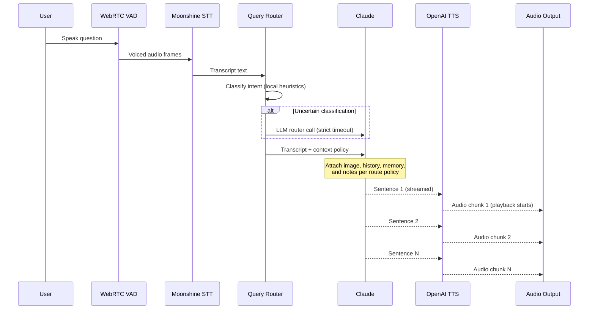

## Overview

This page documents the complete data flow lifecycle of a single question in Klaus, from microphone input through speech recognition, vision processing, LLM reasoning, and text-to-speech output.

## High-Level Sequence



## Stage 1: Audio Capture

### Push-to-Talk Mode

**Implementation**: `klaus/audio.py:33` (`PushToTalkRecorder`)

1. User presses hotkey (default F2)
2. `start_recording()` opens `sd.InputStream` with callback
3. Audio chunks accumulate in memory while key is held
4. User releases key
5. `stop_recording()` concatenates chunks, encodes as WAV bytes
6. Returns WAV buffer to main application

**Key code**:
```python
# klaus/audio.py:77
def stop_recording(self) -> bytes | None:
    with self._lock:
        if not self._recording:
            return None
        # ... concatenate chunks ...
        return to_wav_bytes(audio_data, self._sample_rate)
```

### Voice-Activated Mode

**Implementation**: `klaus/audio.py:102` (`VoiceActivatedRecorder`)

1. Continuous mic stream with 30ms frames (480 samples @ 16 kHz)
2. WebRTC VAD classifies each frame as speech/silence
3. Pre-buffer holds last 300ms of audio
4. Speech detection:
   - First voiced frame triggers `on_speech_start()`
   - Frames accumulate while speaking
   - After `silence_timeout` (default 1.5s) of silence, `_finalize()` fires
5. Quality gates before accepting utterance:
   - Minimum duration (0.5s)
   - Minimum voiced ratio (0.28)
   - Minimum voiced frames (8)
   - Minimum RMS loudness (-45 dBFS)
   - Minimum contiguous voiced run (6 frames)
6. If all gates pass, `on_speech_end(wav_bytes)` fires
7. Otherwise, utterance is discarded and `on_speech_discard(reason)` fires

**Key code**:
```python
# klaus/audio.py:332
def _finalize(self) -> None:
    audio = np.concatenate(self._chunks)
    # ... quality gates ...
    if duration < self._min_duration:
        self._emit_discard("vad_short_duration")
        return
    # ... more gates ...
    wav = to_wav_bytes(audio, self._sample_rate)
    self._emit_speech_end(wav)
```

### Stream Suspension for TTS

Before TTS playback, the VAD mic stream is suspended to free the CoreAudio device:

```python
# klaus/audio.py:245
def suspend_stream(self) -> None:
    if self._stream is not None:
        self._stream.stop()
        self._stream.close()
        self._stream = None
```

After playback, it's reopened via `resume_stream()`. This prevents device contention on macOS.

## Stage 2: Speech-to-Text

**Implementation**: `klaus/stt.py:103`

Moonshine Voice runs entirely on-device:

1. WAV bytes arrive from audio recorder
2. Moonshine model loaded from `~/.cache/moonshine/` (downloaded on first use)
3. Model processes audio in ~300ms
4. Returns transcript as plain text

**Model Configuration** (in `config.toml`):
- `stt_moonshine_model`: `tiny`, `small`, or `medium` (default `medium`, 245M params)
- `stt_moonshine_language`: language code (default `en`)

## Stage 3: Query Routing

**Implementation**: `klaus/query_router.py:118` (`QueryRouter.route()`)

Before sending the full context to Claude, Klaus classifies the question to optimize token usage and response style.

### Local Heuristics (Fast Path)

**Timing**: ~1-2ms

1. Pattern matching against regex signals:
   - `definition`: "define", "what is", "meaning"
   - `doc_ref`: "page", "paper", "section", "figure"
   - `deictic`: "this", "that", "here"
   - `spatial`: "left", "right", "top", "bottom"
   - `concision`: "concisely", "briefly", "quickly"
   - `general`: "summarize", "what is happening"

2. Weighted scoring for three route modes:
   - **Standalone definition**: high definition score, low page score
   - **Page-grounded definition**: high page + definition score
   - **General contextual**: high general + page score

3. If confidence ≥ threshold (default 0.75) and margin ≥ threshold (default 0.20), use local decision

**Key code**:
```python
# klaus/query_router.py:191
def _route_local(self, question: str) -> _LocalDecision:
    signals = _signal_map(question.lower())
    definition = _score(signals, {"definition": 0.55, "explain": 0.18, ...})
    page = _score(signals, {"doc_ref": 0.30, "deictic": 0.22, ...})
    contextual = 0.24 + _score(signals, {"general": 0.44, ...})
    # ... score blending ...
    return _LocalDecision(top_mode, confidence, margin, reason, scores)
```

### LLM Router (Fallback)

**Timing**: ~150-350ms (strict timeout)

If local confidence is low:

1. Short prompt sent to `claude-haiku-4-5`
2. Timeout: `router_timeout_ms` (default 350ms)
3. Max tokens: 80
4. Returns JSON: `{mode, confidence, reason}`
5. If LLM confidence ≥ threshold (default 0.70), use LLM decision
6. Otherwise, fall back to `standalone_definition`

**Key code**:
```python
# klaus/query_router.py:248
def _route_with_llm(self, question: str) -> _LlmDecision | None:
    resp = self._client.messages.create(
        model=config.ROUTER_MODEL,
        max_tokens=config.ROUTER_MAX_TOKENS,
        timeout=max(0.05, config.ROUTER_TIMEOUT_MS / 1000),
        # ...
    )
    return _LlmDecision(mode=mode, confidence=confidence, reason=reason)
```

### Route Policies

| Route | Image | History | Memory | Notes | Max Sentences | History Window |
|-------|:-----:|:-------:|:------:|:-----:|:-------------:|:--------------:|
| **Standalone definition** | ❌ | ❌ | ❌ | ❌ | 2 | 0 |
| **Page-grounded definition** | ✅ | ✅ | ❌ | ❌ | 2 | 2 turns |
| **General contextual** | ✅ | ✅ | ✅ | ✅ | None | Full |

See `klaus/query_router.py:35` for policy definitions.

## Stage 4: Camera Capture

**Implementation**: `klaus/camera.py:59`

Runs in a daemon thread continuously:

1. OpenCV `VideoCapture` polls camera in background loop
2. Frames stored in `self._frame` with thread-safe lock
3. Auto-rotation: portrait frames (h > w) rotated 90° CW automatically (configurable)
4. When question arrives, `capture_base64_jpeg()` encodes most recent frame as JPEG (quality 85) and base64
5. Base64 string sent to Claude as image content block

**Key code**:
```python
# klaus/camera.py:147
def capture_base64_jpeg(self, quality: int = 85) -> str | None:
    frame = self.get_frame()
    if frame is None:
        return None
    _, buf = cv2.imencode(".jpg", frame, [cv2.IMWRITE_JPEG_QUALITY, quality])
    return base64.b64encode(buf.tobytes()).decode("utf-8")
```

## Stage 5: Claude Vision + Tool Use

**Implementation**: `klaus/brain.py:80` (`Brain.ask()`)

### Context Assembly

Based on route decision:

1. **User content**:
   - Image block (if `route.use_image`)
   - Text block with transcript

2. **System prompt**:
   - Base prompt from `config.SYSTEM_PROMPT`
   - User background (if configured)
   - Memory context (if `route.use_memory_context`)
   - Notes context (if `route.use_notes_context`)
   - Turn-specific instruction from route policy
   - Sentence cap (if `route.max_sentences` set)

3. **Message history**:
   - Full history (if `route.use_history` and `history_turn_window == 0`)
   - Last N turns (if `history_turn_window > 0`)
   - Images stripped from all but most recent user message to save tokens

**Key code**:
```python
# klaus/brain.py:115
user_content = self._build_user_content(question, effective_image)
request_messages = self._build_request_messages(user_content, route)
system = config.SYSTEM_PROMPT
if effective_memory:
    system += "\n\nContext from previous sessions:\n" + effective_memory
if route.max_sentences:
    system += f"\n\nHard limit for this turn: respond in no more than {route.max_sentences} sentences."
```

### Streaming Loop

1. Create streaming message with `client.messages.stream()`
2. For each `content_block_delta` event with text:
   - Accumulate into `text_buf`
   - Extract complete sentences via regex split
   - Fire `on_sentence(sentence)` callback for each complete sentence
3. If `stop_reason == "tool_use"`:
   - Execute tool (web search, notes, etc.)
   - Append assistant message + tool results
   - Continue loop (max 5 rounds)
4. Otherwise, emit final fragment and return

**Sentence Extraction**:
```python
# klaus/brain.py:23
def _extract_sentences(buf: str) -> tuple[list[str], str]:
    parts = _SENTENCE_END.split(buf)  # Split on . ! ?
    complete = [p.strip() for p in parts[:-1] if p.strip()]
    remainder = parts[-1]
    return complete, remainder
```

**Tool Execution** (`klaus/brain.py:328`):
- `web_search`: Tavily search via `klaus/search.py:50`
- `set_notes_file`: Change active Obsidian note
- `save_note`: Append content to current note

### Sentence Cap Enforcement

If route policy specifies `max_sentences`:

1. During streaming: stop emitting after N sentences
2. After streaming: hard-truncate assistant text to N sentences via regex

```python
# klaus/brain.py:260
@staticmethod
def limit_sentences(text: str, max_sentences: int | None) -> str:
    parts = [chunk.strip() for chunk in _SENTENCE_CHUNK.findall(text) if chunk.strip()]
    if len(parts) <= max_sentences:
        return text
    return " ".join(parts[:max_sentences]).strip()
```

## Stage 6: Text-to-Speech Streaming

**Implementation**: `klaus/tts.py:92` (`TextToSpeech.speak_streaming()`)

### Sentence Queueing

1. Main thread creates `queue.Queue[str | None]`
2. `Brain.ask()` fires `on_sentence(sentence)` callback
3. Callback puts each sentence into queue
4. After Claude finishes, `None` sentinel added to queue

### Parallel Synthesis + Playback

**Two threads**:

1. **Synthesis worker** (`klaus/tts.py:163`):
   - Reads sentences from queue
   - Calls OpenAI TTS API for each sentence
   - Puts WAV bytes into audio queue
   - Adds `None` sentinel when done

2. **Playback thread** (main TTS loop at `klaus/tts.py:134`):
   - Reads WAV bytes from audio queue
   - Decodes WAV header (sample rate, channels)
   - Ensures persistent `sd.OutputStream` is open
   - Writes audio in small blocks (2048 frames) for responsive stop
   - Closes stream after all chunks played

**Persistent Stream** (`klaus/tts.py:52`):
```python
def _ensure_stream(self, rate: int, channels: int) -> sd.OutputStream:
    with self._stream_lock:
        if self._stream is not None and not self._stream.closed:
            return self._stream
        latency = "high" if sys.platform == "darwin" else "low"
        self._stream = sd.OutputStream(
            samplerate=rate, channels=channels, dtype="int16", latency=latency
        )
        self._stream.start()
        return self._stream
```

This avoids macOS CoreAudio crackling from rapid stream create/destroy.

### Chunk Splitting

API limit: 4000 chars per TTS call. If a sentence exceeds this, it's batched with subsequent sentences up to the limit.

```python
# klaus/tts.py:233
def _split_into_chunks(text: str) -> list[str]:
    sentences = SENTENCE_SPLIT.split(text.strip())
    chunks = []
    current = ""
    for sentence in sentences:
        if len(current) + len(sentence) + 1 > MAX_CHUNK_CHARS:
            chunks.append(current)
            current = sentence
        else:
            current = f"{current} {sentence}".strip()
    return chunks
```

## Stage 7: Persistence

**Implementation**: `klaus/memory.py:254`

After Claude responds:

1. `Exchange` object created with:
   - `user_text`: transcript
   - `assistant_text`: Claude response
   - `image_base64`: page image (if used)
   - `searches`: list of web searches performed
   - `notes_file_changed`: whether notes were updated

2. Saved to SQLite:
   - `sessions` table: session metadata (title, created_at)
   - `exchanges` table: individual Q&A turns

3. UI updated:
   - Chat widget appends message card
   - Session panel updates current session

**Key code**:
```python
# klaus/memory.py:90
def save_exchange(self, session_id: int, user_text: str, assistant_text: str,
                  image_base64: str | None = None) -> None:
    self._db.execute(
        "INSERT INTO exchanges (session_id, user_text, assistant_text, image_base64, created_at) "
        "VALUES (?, ?, ?, ?, ?)",
        (session_id, user_text, assistant_text, image_base64, datetime.now().isoformat())
    )
    self._db.commit()
```

## Performance Characteristics

| Stage | Latency | Notes |
|-------|---------|-------|
| Audio capture (VAD) | 0-1.5s | Silence timeout configurable |
| Speech-to-text (Moonshine) | ~300ms | Runs on CPU, no API call |
| Query routing (local) | ~1-2ms | Regex pattern matching |
| Query routing (LLM fallback) | ~150-350ms | Strict timeout, used only if local uncertain |
| Camera capture | {"<"}50ms | Frame already in memory |
| Claude first token | ~800-1200ms | Vision + reasoning |
| TTS first audio | ~500-800ms | API call per sentence |
| **End-to-end (question → first audio)** | **2-4s** | STT + routing + Claude + TTS |

## Threading Model

| Thread | Purpose | Communication |
|--------|---------|---------------|
| **PyQt6 main thread** | UI event loop, signal handling | `pyqtSignal` |
| **Camera thread** | OpenCV capture loop | Thread-safe frame lock |
| **Question processing thread** | STT → routing → Claude → save | Qt signals to UI |
| **TTS synthesis worker** | OpenAI API calls | `queue.Queue` |
| **TTS playback** | Sounddevice output | `queue.Queue` |
| **Audio callback (VAD)** | WebRTC VAD frame processing | Callbacks to main app |

All daemon threads marked `daemon=True` exit cleanly when main thread terminates.

## Next Steps

- [Module Responsibilities](/architecture/modules) — Detailed module breakdown
- [Query Routing](/architecture/query-routing) — Deep dive into routing logic
