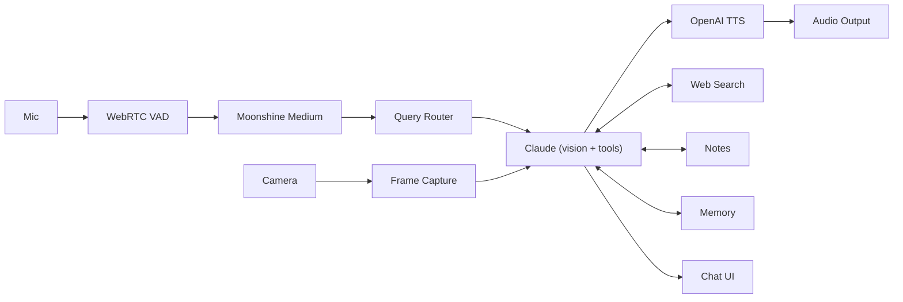

## Introduction

Klaus is a voice-based research assistant for reading physical papers and books. The user places a document under a camera, speaks a question (push-to-talk or voice-activated), and Klaus sees the page via Claude's vision API, reasons about the question, and responds aloud through text-to-speech. It runs as a PyQt6 desktop app on Windows and macOS.

## Technology Stack

### Core Runtime

- **Python 3.11+** with threads (not asyncio)
- **PyQt6** — desktop GUI with dark theme
- **Threading model**: PyQt6 main thread for UI; daemon threads for question processing, camera capture, TTS synthesis. Thread-safe communication via `pyqtSignal`.

### Audio & Vision

| Component | Technology | Purpose |
|-----------|-----------|----------|
| Camera | **OpenCV** | Background camera thread for frame capture |
| Camera Names (macOS) | **AVFoundation (pyobjc)** | Native camera display names |
| Audio Capture | **sounddevice + webrtcvad** | PTT and voice-activated recording |
| Speech-to-Text | **Moonshine Voice** | Local on-device STT (245M params, ~300ms latency, no API cost) |
| Text-to-Speech | **OpenAI gpt-4o-mini-tts** | Sentence-level streaming synthesis |

### AI & Tools

| Component | Service | Details |
|-----------|---------|----------|
| Vision + Reasoning | **Anthropic Claude** | `claude-sonnet-4-6` with vision + tool use |
| Query Router | **claude-haiku-4-5** | Hybrid local + LLM route classifier |
| Web Search | **Tavily** | Exposed as a Claude tool |
| Memory | **SQLite** | Persistent sessions at `~/.klaus/klaus.db` |
| Note-taking | **Obsidian** | Optional vault integration |

### Configuration & Hotkeys

- **Config**: `~/.klaus/config.toml` (user settings + API keys) with `.env` fallback
- **Hotkeys**: `pynput` for global hotkeys (cross-platform)
- **API Keys**: Apple Keychain on macOS; `~/.klaus/config.toml` on Windows

## Architecture Diagram

## Key Design Decisions

### No asyncio

Anthropic/OpenAI sync clients work fine with threads; PyQt's event loop doesn't integrate easily with asyncio. All I/O-bound operations run in daemon threads with signal-based communication back to the main UI thread.

### Input Modes

- **Push-to-talk** (default F2): Hold key to record, release to send
- **Voice-activated** (toggle F3): WebRTC VAD detects speech boundaries automatically

Both PTT and toggle keys are configurable in `config.toml`. Two hotkey backends run in parallel:

1. **Qt key events** on `MainWindow` (`keyPressEvent`/`keyReleaseEvent`) work when focused with no OS permissions
2. **pynput** provides global hotkeys but requires macOS Accessibility permission

### TTS Sentence Batching

Claude's response is split into sentences; a synthesis worker generates audio per chunk; playback starts on the first chunk for low perceived latency. Max 4000 chars per API call. A single persistent `sd.OutputStream` is reused across all chunks in a session (avoids macOS CoreAudio crackling from rapid stream create/destroy). On macOS, uses `latency='high'`. The VAD mic stream is suspended (`suspend_stream`) before TTS playback and reopened (`resume_stream`) after, freeing the CoreAudio device during output.

See `klaus/tts.py:52` for stream lifecycle management.

### Local STT

Moonshine Voice runs on-device (no API call). Model and language are configurable in `config.toml`. Downloaded on first use via the setup wizard.

### Persistent Memory

SQLite at `~/.klaus/klaus.db` with tables for `sessions`, `exchanges`, and `knowledge_profile`. Knowledge summary is injected into Claude's system prompt. See `klaus/memory.py:254` for schema details.

### Safe Slots

PyQt6 calls `abort()` when an unhandled Python exception escapes a slot invoked from C++ signal dispatch. All `KlausApp` slot handlers connected to UI signals use the `@_safe_slot` decorator (defined in `klaus/main.py:941`) which catches and logs exceptions so the app stays alive.

### Cross-Platform Considerations

Windows and macOS are fully supported. Platform-specific code is guarded by `sys.platform` checks:

- `cv2.CAP_DSHOW` (Windows camera backend)
- `moonshine.dll` preload (Windows DLL conflict workaround)
- DWM dark title bar (Windows only, no-op elsewhere)
- AVFoundation camera names (macOS only)
- Apple Keychain API key storage (macOS only)

## Module Organization

### Core (`klaus/`)

| Module | Lines | Purpose |
|--------|------:|----------|
| `config.py` | 527 | Config via TOML + .env, models, voice settings, dynamic system prompt with user background, query-router thresholds/feature flags |
| `main.py` | 941 | Entry point; wires all components, hotkeys (conditional pynput + Qt), setup wizard gate, Qt signal bridge |
| `brain.py` | 440 | Claude vision + tool-use loop, route-aware context assembly, sentence-cap enforcement, conversation history, streaming |
| `query_router.py` | 458 | Hybrid local + LLM route classifier with timeout/fallback; maps question intent to context policy |
| `audio.py` | 486 | PushToTalkRecorder, VoiceActivatedRecorder (with device selection, suspend/resume stream), AudioPlayer |
| `camera.py` | 164 | OpenCV background thread, frame capture, auto-rotation, base64/thumbnail export |
| `tts.py` | 248 | OpenAI gpt-4o-mini-tts with persistent OutputStream, sentence-level batching |
| `stt.py` | 103 | Moonshine Voice local transcription |
| `memory.py` | 254 | SQLite persistence (sessions, exchanges, knowledge_profile) |
| `notes.py` | 100 | Obsidian vault note-taking (set_notes_file, save_note tools) |
| `search.py` | 50 | Tavily web search tool definition + execution |
| `device_catalog.py` | 221 | Shared camera/mic enumeration and labeling |

### UI (`klaus/ui/`)

| Module | Lines | Purpose |
|--------|------:|----------|
| `theme.py` | 586 | Palette tokens, dimensions, single `application_stylesheet()` QSS, `apply_dark_titlebar()`, `load_fonts()` |
| `main_window.py` | 204 | Top-level window layout, splitter, header, settings button |
| `chat_widget.py` | 260 | Scrollable chat feed with message cards, thumbnails, replay |
| `session_panel.py` | 190 | Session list sidebar with context menu |
| `setup_wizard.py` | 904 | First-run 7-step setup wizard (API keys, camera, mic, model download, user background, Obsidian vault) |
| `settings_dialog.py` | 443 | Tabbed settings dialog (API keys, camera, mic, profile + Obsidian vault) with immediate camera/mic apply |
| `status_widget.py` | 120 | Status bar (Idle/Listening/Thinking/Speaking), mode toggle, stop |
| `camera_widget.py` | 71 | Live camera preview (~30 fps) |

## Latency and Cost

End-to-end latency from question to first spoken word is **2-4 seconds** (STT + Claude + first TTS chunk). TTS streams sentence-by-sentence so playback starts before the full response is generated.

| Usage | Approx. cost |
|-------|-------------|
| 10 questions | ~$0.05 |
| 50 questions | ~$0.25 |
| 100 questions/day | ~$2.50-3.50/day |

Largest cost driver is Claude Sonnet 4.6 (vision + context window). STT is free via local Moonshine Medium. TTS is $0.015/min of generated audio.

## Next Steps

- [Data Flow](/architecture/data-flow) — How data flows from mic to speaker
- [Module Responsibilities](/architecture/modules) — Detailed module breakdown
- [Query Routing](/architecture/query-routing) — Context optimization and routing logic
