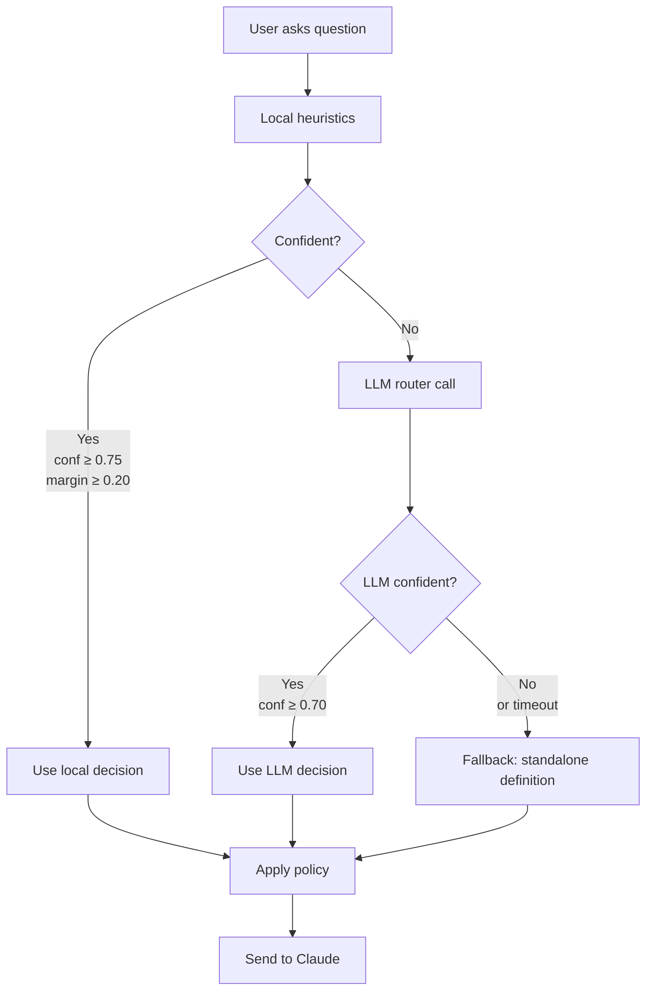

## Overview

Klaus uses a **hybrid local + LLM query router** to classify each question before sending it to Claude. This classification determines what context (image, history, memory, notes) is sent and how the response is styled (sentence caps, instructions).

**Goals**:
1. **Reduce token usage**: Don't send page image for standalone definitions
2. **Optimize latency**: Use fast local heuristics for 80%+ of questions
3. **Improve quality**: Enforce concise definitions when appropriate

**Implementation**: `klaus/query_router.py:118` (`QueryRouter.route()`)

## Route Modes

Three routing categories:

### 1. Standalone Definition

**When**: User asks for a concept definition without page context

**Examples**:
- "Define macroeconomics"
- "What is quantum entanglement?"
- "Explain photosynthesis very concisely"

**Policy**:
- ❌ No image
- ❌ No history
- ❌ No memory context
- ❌ No notes context
- ✅ Max 2 sentences
- Turn instruction: "Return a direct standalone definition in at most two sentences. Do not reference the page unless explicitly asked."

**Rationale**: These questions don't need page context. The concise response keeps study loops fast.

---

### 2. Page-Grounded Definition

**When**: User asks for a definition tied to a specific page location

**Examples**:
- "What does the term on the far right mean?"
- "Explain the definition in the top left"
- "What is complexity in this context?"

**Policy**:
- ✅ Image included
- ✅ Short history (last 2 turns)
- ❌ No memory context
- ❌ No notes context
- ✅ Max 2 sentences
- History window: 2 turns
- Turn instruction: "Answer the definition request using the relevant page location. Keep the answer to at most two sentences."

**Rationale**: Spatial references ("far right", "top left") require the page image. Short history provides continuity. Still concise.

---

### 3. General Contextual

**When**: Open-ended questions about the page or complex reasoning

**Examples**:
- "What does this section mean?"
- "Summarize the main argument"
- "How does this relate to the previous chapter?"

**Policy**:
- ✅ Image included
- ✅ Full conversation history
- ✅ Memory context from past sessions
- ✅ Notes context if Obsidian configured
- ✅ No sentence cap
- Turn instruction: None (default system prompt)

**Rationale**: These need full context for best answers. No artificial brevity constraint.

---

## Decision Flow



## Local Heuristics (Fast Path)

**Implementation**: `klaus/query_router.py:191` (`_route_local()`)

**Timing**: ~1-2ms

### Pattern Matching

Six regex signals:

```python
_PATTERN = {
    "definition": r"\b(define|definition|what is|what's|who is|meaning|what does .* mean|explain what .* means)\b",
    "explain": r"\bexplain\b",
    "concision": r"\b(very concisely|concisely|briefly|in short|quickly|quick summary)\b",
    "doc_ref": r"\b(page|paper|book|text|paragraph|section|definition|figure|table|equation)\b",
    "deictic": r"\b(this|that|here|there|above|below)\b",
    "spatial": r"\b(left|right|far right|far left|top|bottom|upper|lower|middle|center)\b",
    "on_page": r"\b(on|in|from)\s+the\s+([a-z]+\s+){0,3}(page|paragraph|section|figure|table|equation|left|right|top|bottom)\b",
    "general": r"\b(summarize|walk me through|what is happening|what does this section mean)\b",
}
```

### Weighted Scoring

Each route mode gets a score based on matched signals:

```python
# Standalone definition score
definition = _score(signals, {
    "definition": 0.55,
    "explain": 0.18,
    "concision": 0.16,
})
standalone_score = (definition * 1.12) - (page * 0.68)
if signals["concision"]:
    standalone_score += 0.08

# Page-grounded definition score
page = _score(signals, {
    "doc_ref": 0.30,
    "deictic": 0.22,
    "spatial": 0.25,
    "on_page": 0.24,
})
page_definition_score = page
if definition > 0.60:
    page_definition_score += (definition - 0.60) * 1.25
if signals["spatial"] and signals["doc_ref"]:
    page_definition_score += 0.22

# General contextual score
contextual = 0.24 + _score(signals, {
    "general": 0.44,
    "deictic": 0.16,
    "doc_ref": 0.10,
})
contextual_score = contextual + (page * 0.70)
if definition > 0.75 and page > 0.35:
    contextual_score -= 0.16
```

### Confidence Calculation

Top score vs. second score:

```python
def _confidence(top_score: float, second_score: float) -> float:
    if second_score <= 0:
        return 0.99 if top_score > 0 else 0.34
    margin = (top_score - second_score) / (top_score + second_score + 1e-6)
    return min(0.99, max(0.0, 0.5 + margin))
```

**Decision criteria**:
- Confidence ≥ `ROUTER_LOCAL_CONFIDENCE_THRESHOLD` (default 0.75)
- Margin ≥ `ROUTER_LOCAL_MARGIN_THRESHOLD` (default 0.20)

If both met, use local decision. Otherwise, fall back to LLM router.

---

## LLM Router (Fallback)

**Implementation**: `klaus/query_router.py:248` (`_route_with_llm()`)

**Timing**: ~150-350ms (strict timeout)

**When**: Local confidence too low or margin too narrow

### System Prompt

```
You classify user questions for a document-camera assistant.
Return JSON only with keys mode, confidence, reason.
mode must be one of: standalone_definition, page_grounded_definition, general_contextual.

Use standalone_definition for direct concept definitions without requested page grounding.
Use page_grounded_definition for definition requests tied to page location or document references
(e.g., 'definition on the far right').
Use general_contextual for general page interpretation.

confidence must be between 0 and 1.
```

### Example Prompt

```
Classify this question.

Examples:
- Explain macroeconomics very concisely. => standalone_definition
- Explain what complexity means in the definition on the far right. => page_grounded_definition
- What does this section mean? => general_contextual

Question: [user's question]
```

### Configuration

| Setting | Default | Purpose |
|---------|---------|----------|
| `ROUTER_MODEL` | `claude-haiku-4-5` | Fast, cheap LLM for routing |
| `ROUTER_TIMEOUT_MS` | 350 | Strict timeout to prevent latency spike |
| `ROUTER_MAX_TOKENS` | 80 | Limit output size |
| `ROUTER_LLM_CONFIDENCE_THRESHOLD` | 0.70 | Min confidence to use LLM decision |

### Timeout Handling

If LLM call times out or fails:

```python
try:
    resp = self._client.messages.create(
        model=config.ROUTER_MODEL,
        timeout=max(0.05, config.ROUTER_TIMEOUT_MS / 1000),
        # ...
    )
except Exception as exc:
    logger.warning("LLM query router failed: %s", exc)
    return None
```

Fallback to `standalone_definition` with confidence 0.5.

---

## Fallback Policy

If both local and LLM routing fail or return low confidence:

**Mode**: `standalone_definition`

**Confidence**: 0.5

**Reason**: `"fallback:low_conf(local=X.XX,llm=Y.YY)"`

**Rationale**: Standalone definition is the safest default. It won't send unnecessary context and enforces brevity, which is better than a wrong classification.

---

## Policy Table

| Route Mode | Image | History | Memory | Notes | Max Sentences | History Window | Turn Instruction |
|------------|:-----:|:-------:|:------:|:-----:|:-------------:|:--------------:|------------------|
| **Standalone definition** | ❌ | ❌ | ❌ | ❌ | 2 | 0 | "Return a direct standalone definition in at most two sentences. Do not reference the page unless explicitly asked." |
| **Page-grounded definition** | ✅ | ✅ | ❌ | ❌ | 2 | 2 | "Answer the definition request using the relevant page location. Keep the answer to at most two sentences." |
| **General contextual** | ✅ | ✅ | ✅ | ✅ | None | 0 (full) | None |

**Implementation**: `klaus/query_router.py:35` (`_POLICY`)

```python
_POLICY = {
    "standalone": {
        "use_image": False,
        "use_history": False,
        "use_memory_context": False,
        "use_notes_context": False,
        "max_sentences": 2,
        "history_turn_window": 0,
        "turn_instruction": (
            "Return a direct standalone definition in at most two sentences. "
            "Do not reference the page unless explicitly asked."
        ),
    },
    "page_definition": {
        "use_image": True,
        "use_history": True,
        "use_memory_context": False,
        "use_notes_context": False,
        "max_sentences": 2,
        "history_turn_window": 2,
        "turn_instruction": (
            "Answer the definition request using the relevant page location. "
            "Keep the answer to at most two sentences."
        ),
    },
    "contextual": {
        "use_image": True,
        "use_history": True,
        "use_memory_context": True,
        "use_notes_context": True,
        "max_sentences": None,
        "history_turn_window": 0,
        "turn_instruction": None,
    },
}
```

---

## Sentence Cap Enforcement

For routes with `max_sentences` set:

### During Streaming

**Implementation**: `klaus/brain.py:250`

```python
for event in stream:
    if event.type == "content_block_delta":
        text_buf += event.delta.text
        sentences, text_buf = _extract_sentences(text_buf)
        for sentence in sentences:
            if max_sentences is None or emitted_sentences < max_sentences:
                on_sentence(sentence)
                emitted_sentences += 1
```

Stop emitting sentences after N sentences have been sent to TTS.

### After Streaming

**Implementation**: `klaus/brain.py:260`

```python
@staticmethod
def limit_sentences(text: str, max_sentences: int | None) -> str:
    clean = text.strip()
    if not clean or max_sentences is None or max_sentences < 1:
        return clean
    parts = [chunk.strip() for chunk in _SENTENCE_CHUNK.findall(clean) if chunk.strip()]
    if len(parts) <= max_sentences:
        return clean
    return " ".join(parts[:max_sentences]).strip()
```

Hard-truncate the assistant text to N sentences before saving to database.

**Regex**: `_SENTENCE_CHUNK = re.compile(r"[^.!?]+(?:[.!?]+|$)")`

---

## Example Classifications

### Example 1: Standalone Definition

**Question**: "Define macroeconomics very concisely"

**Local Signals**:
- `definition`: ✅ ("Define")
- `concision`: ✅ ("very concisely")
- `doc_ref`: ❌
- `spatial`: ❌

**Scores**:
- `standalone_score`: 0.93
- `page_definition_score`: 0.12
- `contextual_score`: 0.24

**Decision**: `standalone_definition` (confidence 0.92, margin 0.81)

**Result**:
- No image sent
- 2-sentence limit enforced
- Fast, concise response

---

### Example 2: Page-Grounded Definition

**Question**: "Explain what complexity means in the definition on the far right"

**Local Signals**:
- `definition`: ✅ ("definition")
- `explain`: ✅ ("Explain")
- `doc_ref`: ✅ ("definition")
- `spatial`: ✅ ("far right")
- `on_page`: ✅ ("in the definition")

**Scores**:
- `standalone_score`: 0.35
- `page_definition_score`: 1.08
- `contextual_score`: 0.52

**Decision**: `page_grounded_definition` (confidence 0.88, margin 0.56)

**Result**:
- Image sent
- Last 2 turns of history sent
- 2-sentence limit enforced
- Claude knows to look at "far right" of page

---

### Example 3: General Contextual

**Question**: "What does this section mean?"

**Local Signals**:
- `general`: ✅ ("what does this section mean")
- `deictic`: ✅ ("this")
- `doc_ref`: ✅ ("section")

**Scores**:
- `standalone_score`: -0.20
- `page_definition_score`: 0.30
- `contextual_score`: 0.94

**Decision**: `general_contextual` (confidence 0.81, margin 0.64)

**Result**:
- Image sent
- Full conversation history sent
- Memory context from past sessions sent
- Notes context sent (if Obsidian configured)
- No sentence cap
- Detailed, contextualized answer

---

### Example 4: Ambiguous → LLM Fallback

**Question**: "Is that important?"

**Local Signals**:
- `deictic`: ✅ ("that")

**Scores**:
- `standalone_score`: -0.68
- `page_definition_score`: 0.22
- `contextual_score`: 0.40

**Local confidence**: 0.29 (below 0.75 threshold)

**LLM Router** (350ms timeout):
- Returns: `{mode: "general_contextual", confidence: 0.82, reason: "Requires page context to evaluate importance"}`

**Decision**: `general_contextual` (source: llm)

**Result**: Full context sent

---

## Performance Impact

### Token Savings

**Standalone definition** vs. **General contextual** for "Define macroeconomics":

| Context | Tokens | Notes |
|---------|-------:|-------|
| Image (base64 JPEG) | ~1700 | Omitted in standalone |
| Full history (10 turns) | ~2000 | Omitted in standalone |
| Memory context | ~300 | Omitted in standalone |
| Notes context | ~200 | Omitted in standalone |
| **Total saved** | **~4200** | 70-80% token reduction |

**Cost impact**: Standalone definition costs ~$0.002 per turn; general contextual costs ~$0.008 per turn (4x difference).

### Latency Comparison

| Route Path | Latency | Notes |
|------------|--------:|-------|
| Local confident | ~1-2ms | 80%+ of questions |
| LLM fallback | ~150-350ms | 15-20% of questions |
| Timeout fallback | ~350ms | {"<"}5% of questions |

**Total routing overhead**: 1-350ms (avg ~20-30ms across all questions)

---

## Configuration

All router settings in `~/.klaus/config.toml`:

```toml
# Enable/disable routing (default: true)
enable_query_router = true

# Local heuristics thresholds
router_local_confidence_threshold = 0.75
router_local_margin_threshold = 0.20

# LLM router settings
router_model = "claude-haiku-4-5"
router_timeout_ms = 350
router_max_tokens = 80
router_llm_confidence_threshold = 0.70
```

**Disable routing** (always use general contextual):
```toml
enable_query_router = false
```

**Increase local confidence** (fewer LLM calls, more fallbacks):
```toml
router_local_confidence_threshold = 0.85
router_local_margin_threshold = 0.30
```

**Decrease LLM timeout** (faster fallback, fewer LLM decisions):
```toml
router_timeout_ms = 200
```

---

## Future Improvements

**Current Gaps** (from `CLAUDE.md:183`):

- **Router cost/latency tuning**: Ambiguous turns may incur extra routing call. Tune thresholds if latency or fallback behavior needs adjustment.
- **Pattern weights**: Current weights are hand-tuned. Could train on labeled dataset for better accuracy.
- **Caching**: LLM router could cache decisions for repeated questions (not implemented).

---

## Next Steps

- [Architecture Overview](/architecture/overview) — High-level system design
- [Data Flow](/architecture/data-flow) — End-to-end question lifecycle
- [Module Responsibilities](/architecture/modules) — Detailed module breakdown
